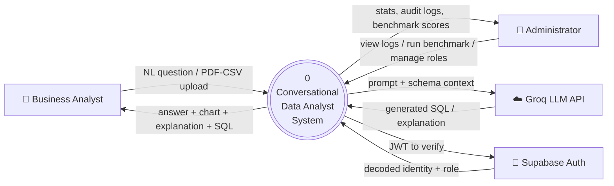
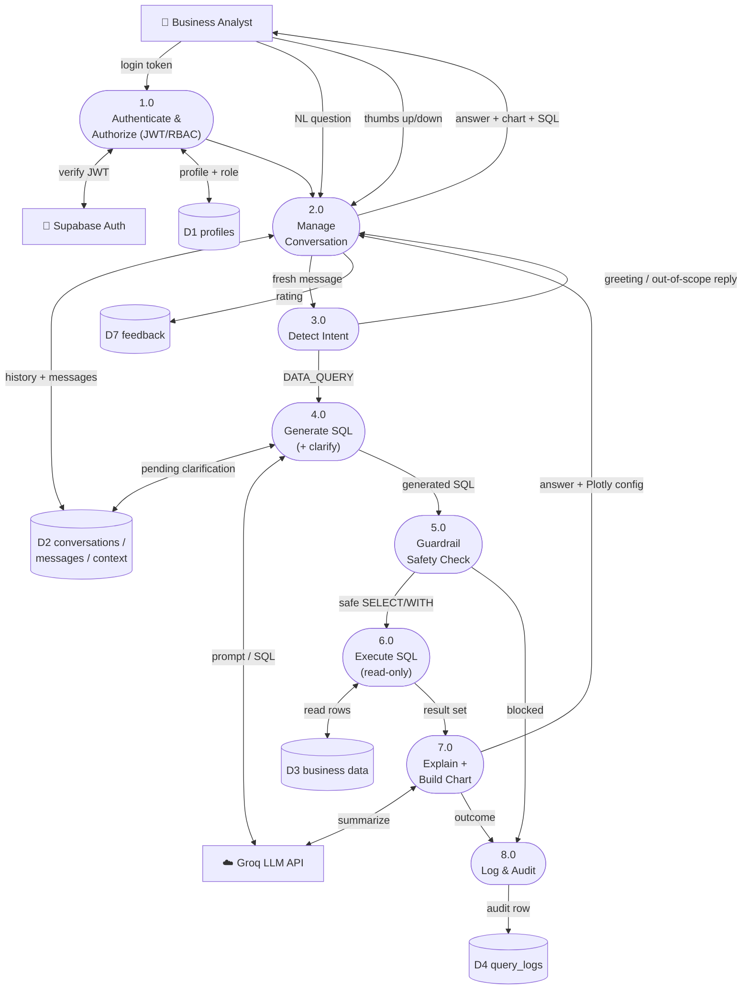
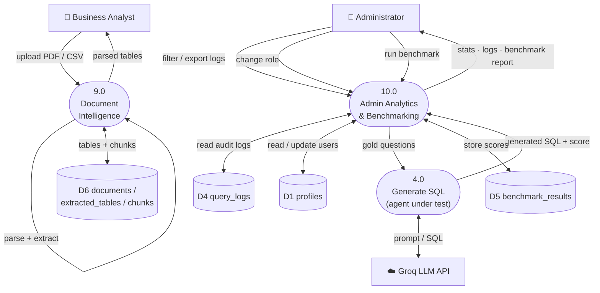

# Data Flow Diagram (DFD)

Data flow for the **Conversational Data Analyst**. Processes are numbered per DFD
convention, data stores are cylinders, and external entities are rectangles.

## Level 0 — Context Diagram

The whole system as a single process, showing only the external entities and the
data that crosses the system boundary.

## Level 1a — Conversational Query Path

The core NL→SQL flow: authenticate, understand the question, generate and guard
the SQL, execute it read-only, then explain and chart the result.

## Level 1b — Documents & Admin Path

Document intelligence (PDF/CSV parsing) and the administrator's oversight
functions: audit logs, RBAC, and the benchmark evaluation.

**Legend** — `([ rounded ])` = process · `[( cylinder )]` = data store · `[ box ]` = external entity.
Process **4.0** appears in both paths: live queries (1a) and benchmark scoring (1b).
