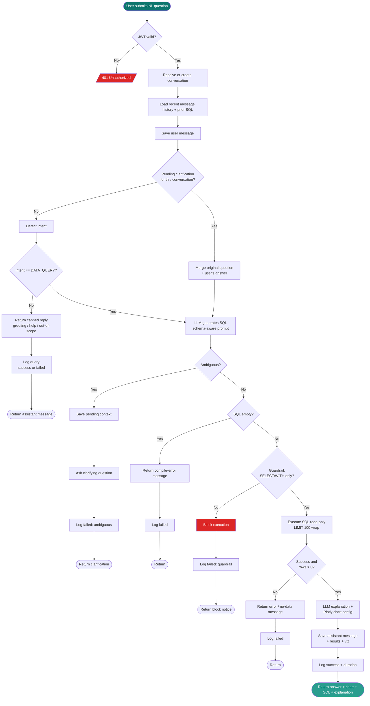

# Flowchart — Natural-Language Query Pipeline

End-to-end control flow of `POST /api/v1/chat/query` (`backend/app/api/v1/chat.py`),
the core path that turns a natural-language question into an answer.

