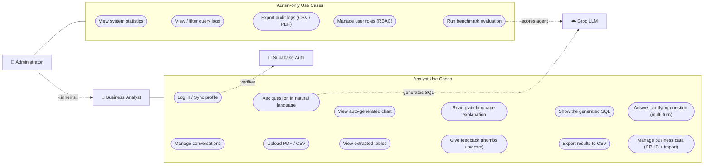

# Use Case Diagram

Actors and use cases for the **Conversational Data Analyst**. The Administrator
inherits every Analyst capability and adds operational/oversight cases. Groq LLM
and Supabase Auth are secondary (system) actors.

> Note: Mermaid has no native UML use-case notation, so ellipses (`([ ])`) denote
> use cases and the boxes denote the system boundary and actors — semantically
> equivalent to a standard UML use-case diagram. The Administrator association to
> "Analyst Use Cases" is implied by the «inherits» generalization.
